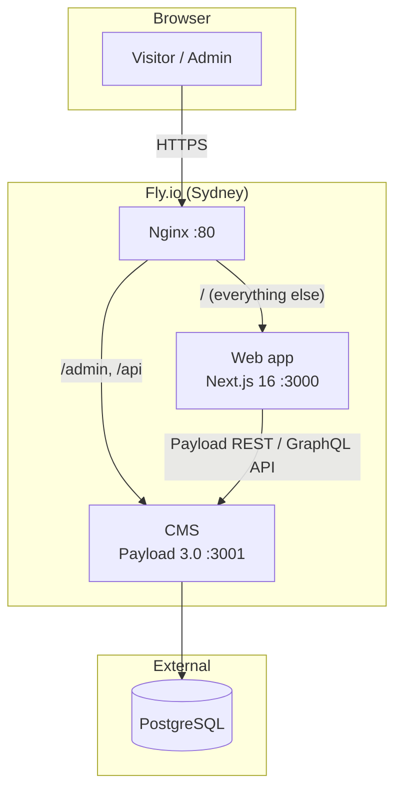
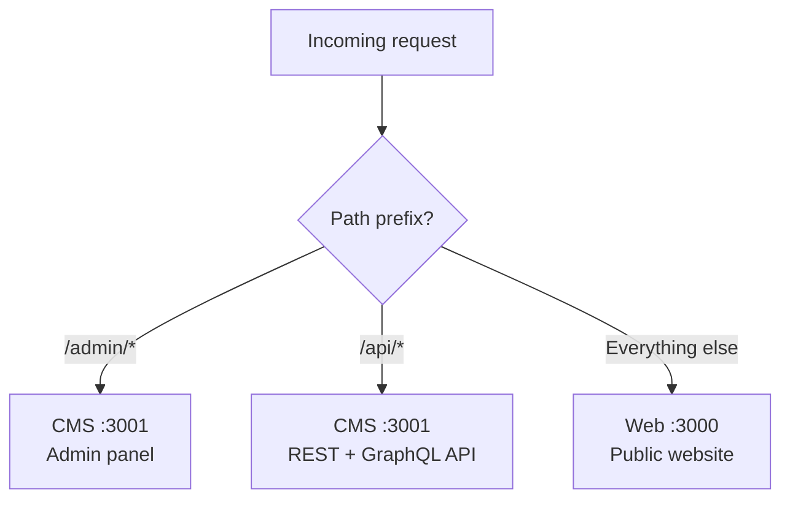
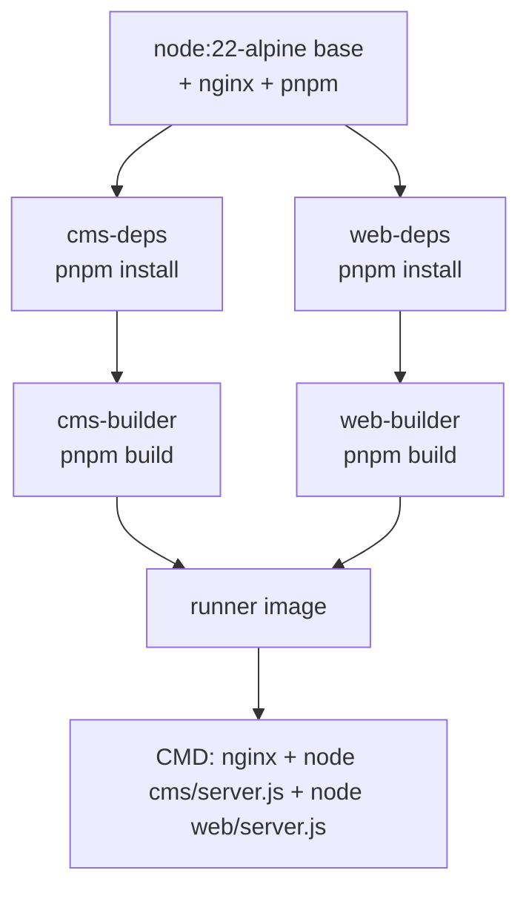

# Architecture

## Repo structure

The repo contains two Next.js apps that are built and deployed together as a single container:

```
ssa/
├── web/        # Next.js 16 public-facing website
├── cms/        # Payload CMS 3.0 admin + content API
├── Dockerfile  # Multi-stage build combining both apps
├── nginx.conf  # Reverse proxy routing
└── fly.toml    # Fly.io deployment config
```

There are no shared packages — the web app consumes content from the CMS via its REST/GraphQL API at runtime.

## System components



## Request routing

Nginx is the single entry point. All traffic hits port 80 (force-HTTPS on Fly.io), and is routed by path prefix:



## Docker multi-stage build

Both apps share a single `Dockerfile` at the repo root. They are built independently and combined into one runner image:



Both Next.js apps use `output: 'standalone'` so only the minimal runtime files are copied into the final image.

## Technology choices

| Layer      | Technology              | Why                                                      |
| ---------- | ----------------------- | -------------------------------------------------------- |
| Frontend   | Next.js 16 (App Router) | SSR + React Server Components                            |
| Styling    | Tailwind CSS 4          | Utility-first                                            |
| CMS        | Payload 3.0             | Code-first CMS, runs as a Next.js app, type-safe         |
| Database   | PostgreSQL              | Payload's postgres adapter; hosted externally            |
| Proxy      | Nginx                   | Routes `/admin` + `/api` to CMS, everything else to web  |
| Deployment | Fly.io                  | Single container, Sydney region (`syd`), 256 MB RAM      |
