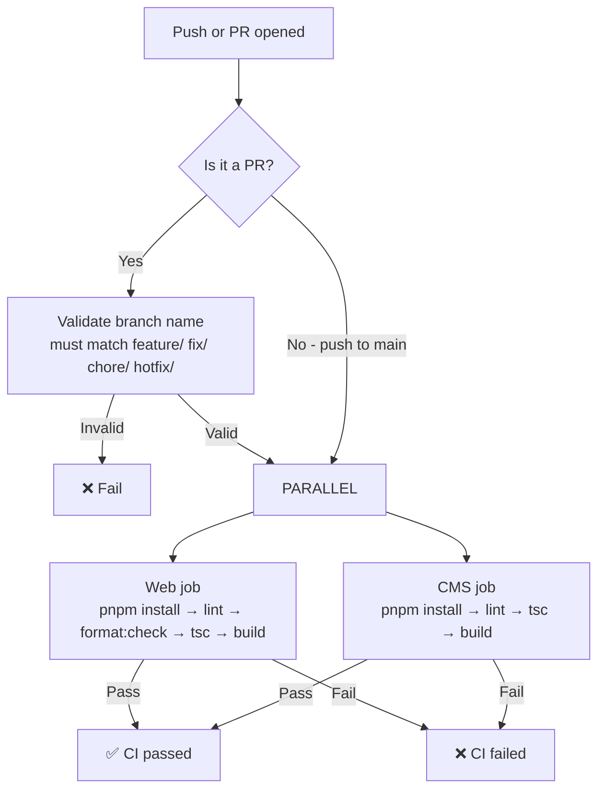
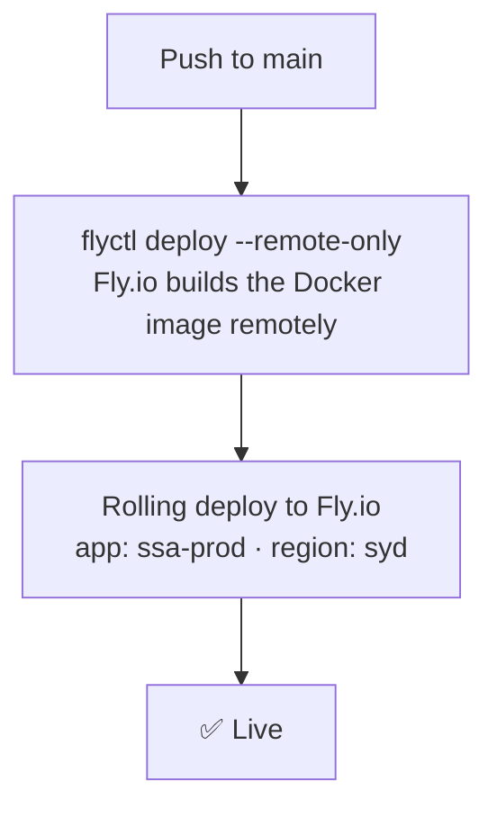
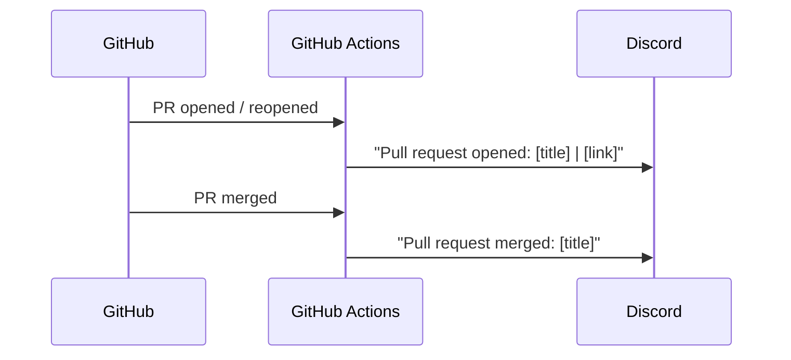

# CI/CD

## Overview

There are three GitHub Actions workflows in `.github/workflows/`:

| Workflow               | Trigger                        | What it does                              |
| ---------------------- | ------------------------------ | ----------------------------------------- |
| `ci.yml`               | Every PR + push to `main`      | Lint, typecheck, build both apps          |
| `fly-deploy.yml`       | Push to `main`                 | Deploy to Fly.io                          |
| `pr-notifications.yml` | PR opened / reopened / merged  | Post Discord notification                 |

## CI pipeline

The web and CMS jobs run in parallel. Both must pass for CI to be green.

## Deploy pipeline

Deploys are triggered automatically on every push to `main`. Only one deploy runs at a time (`concurrency: deploy-group`).

`--remote-only` means the Docker build runs on Fly.io's infrastructure, not in the GitHub Actions runner — no large image transfer required.

## PR notifications

When a PR is opened, reopened, or merged, a Discord webhook posts a message to the team channel.

The webhook URL is stored as the `DISCORD_WEBHOOK_URL` repository secret.

## Required secrets

| Secret               | Used by              | Purpose                             |
| -------------------- | -------------------- | ----------------------------------- |
| `PAYLOAD_SECRET`     | `ci.yml` (CMS build) | Required to build the CMS           |
| `DATABASE_URL`       | `ci.yml` (CMS build) | Required to build the CMS           |
| `FLY_API_TOKEN`      | `fly-deploy.yml`     | Authenticates with Fly.io           |
| `DISCORD_WEBHOOK_URL`| `pr-notifications.yml` | Posts messages to Discord         |
