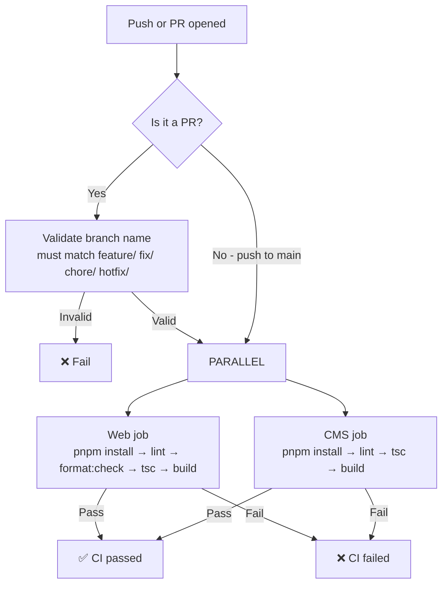
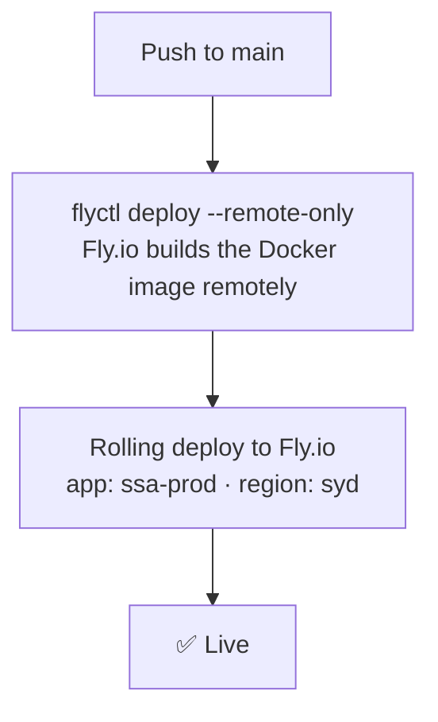
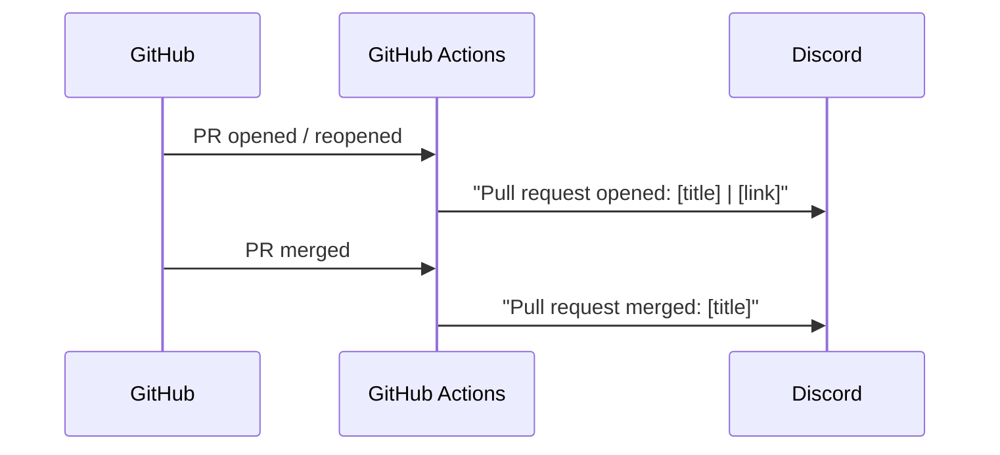

# CI/CD

## Overview

There are three GitHub Actions workflows in `.github/workflows/`:

| Workflow               | Trigger                        | What it does                              |
| ---------------------- | ------------------------------ | ----------------------------------------- |
| `ci.yml`               | Every PR + push to `main`      | Lint, typecheck, build both apps          |
| `fly-deploy.yml`       | Push to `main`                 | Deploy to Fly.io                          |
| `pr-notifications.yml` | PR opened / reopened / merged  | Post Discord notification                 |

## CI pipeline


```mermaid
flowchart TD
    PUSH[Push or PR opened]

    PUSH --> VALIDATE{Is it a PR?}
    VALIDATE -->|Yes| BRANCH[Validate branch name<br/>must match feature/ fix/ chore/ hotfix/]
    BRANCH -->|Invalid| FAIL_BRANCH[❌ Fail]
    BRANCH -->|Valid| PARALLEL

    VALIDATE -->|No - push to main| PARALLEL

    PARALLEL --> WEB_JOB[Web job<br/>pnpm install → lint → format:check → tsc → build]
    PARALLEL --> CMS_JOB[CMS job<br/>pnpm install → lint → tsc → build]

    WEB_JOB -->|Pass| SUCCESS[✅ CI passed]
    CMS_JOB -->|Pass| SUCCESS
    WEB_JOB -->|Fail| FAIL[❌ CI failed]
    CMS_JOB -->|Fail| FAIL
```

The web and CMS jobs run in parallel. Both must pass for CI to be green.

## Deploy pipeline

Deploys are triggered automatically on every push to `main`. Only one deploy runs at a time (`concurrency: deploy-group`).


```mermaid
flowchart TD
    MAIN[Push to main]
    MAIN --> BUILD[flyctl deploy --remote-only<br/>Fly.io builds the Docker image remotely]
    BUILD --> DEPLOY[Rolling deploy to Fly.io<br/>app: ssa-prod · region: syd]
    DEPLOY --> LIVE[✅ Live]
```

`--remote-only` means the Docker build runs on Fly.io's infrastructure, not in the GitHub Actions runner — no large image transfer required.

Two health checks (`/` for web, `/health` for the CMS) run against the machine. A deploy where either app fails to boot is rolled back instead of reporting success and serving 502s. `/health` is a CMS route that deliberately does not initialise Payload or touch Postgres, so a database outage degrades the site rather than rolling back every deploy.

## Runtime configuration

Non-secret config lives in `fly.toml` under `[env]`:

| Variable | Value | Why |
| --- | --- | --- |
| `CMS_URL` | `http://localhost:3001` | The web app calls the CMS over localhost inside the container |
| `WEB_URL` | `https://ssa-prod.fly.dev` | Stripe success/cancel redirects |
| `GOOGLE_OAUTH_REDIRECT_URI` | `https://ssa-prod.fly.dev/api/auth/google/callback` | Must match the URI registered in Google Cloud Console |

`NEXT_PUBLIC_CMS_URL` is **not** a runtime variable — Next inlines `NEXT_PUBLIC_*` into the browser bundle at build time, so it is a Docker build arg (defaulting to the production origin) in the `web-builder` stage.

Everything else is a Fly secret, set once with `flyctl secrets set KEY=value`:

```
DATABASE_URL  PAYLOAD_SECRET  SIGNUP_ENCRYPTION_KEY
STRIPE_SECRET_KEY  STRIPE_WEBHOOK_SECRET  STRIPE_PRICE_ID
S3_ENDPOINT  S3_ACCESS_KEY_ID  S3_SECRET_ACCESS_KEY  S3_BUCKET  S3_REGION  SUPABASE_URL
GOOGLE_CLIENT_ID  GOOGLE_CLIENT_SECRET  GOOGLE_OAUTH_COOKIE_SECRET
```

Check what is currently set with `flyctl secrets list` (names only — Fly never shows values).

## PR notifications

When a PR is opened, reopened, or merged, a Discord webhook posts a message to the team channel.


```mermaid
sequenceDiagram
    participant GitHub
    participant GitHub Actions
    participant Discord

    GitHub->>GitHub Actions: PR opened / reopened
    GitHub Actions->>Discord: "Pull request opened: [title] | [link]"

    GitHub->>GitHub Actions: PR merged
    GitHub Actions->>Discord: "Pull request merged: [title]"
```

The webhook URL is stored as the `DISCORD_WEBHOOK_URL` repository secret.

## Required secrets

| Secret               | Used by              | Purpose                             |
| -------------------- | -------------------- | ----------------------------------- |
| `PAYLOAD_SECRET`     | `ci.yml` (CMS build) | Required to build the CMS           |
| `DATABASE_URL`       | `ci.yml` (CMS build) | Required to build the CMS           |
| `FLY_API_TOKEN`      | `fly-deploy.yml`     | Authenticates with Fly.io           |
| `DISCORD_WEBHOOK_URL`| `pr-notifications.yml` | Posts messages to Discord         |
