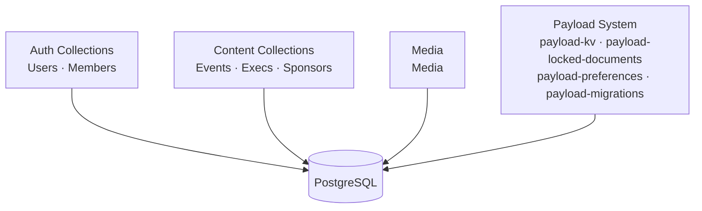
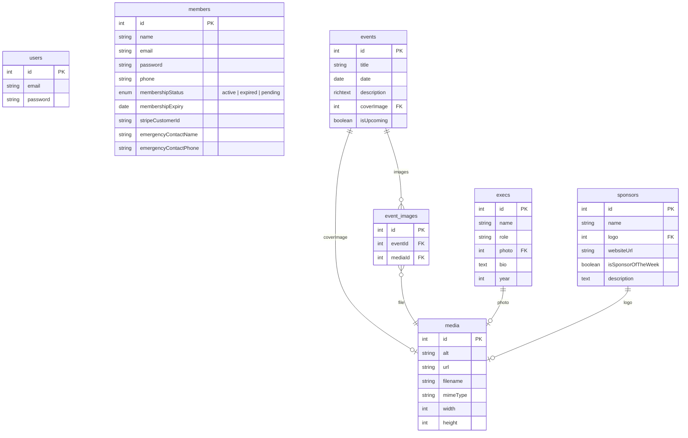

# Database

## Overview

The database is PostgreSQL, managed by [Payload CMS](https://payloadcms.com) using the `@payloadcms/db-postgres` adapter. The schema is defined through Payload collection configs in `cms/src/collections/` and registered in `cms/src/payload.config.ts`. Payload handles migrations automatically.

The generated TypeScript types live in `cms/src/payload-types.ts` — regenerate them after any schema change:

```bash
cd cms
pnpm generate:types
```

## Collections



### Auth collections

**`users`** — Payload admin accounts. Email/password auth is built in. Anyone with a user account can access the `/admin` panel.

**`members`** — SSA member accounts. Email/password auth enabled. Separate from admin users — members do not have CMS admin access.

### Content collections

**`events`** — Events displayed on the public site. Read-only from the web app's perspective; managed by admins in the CMS.

**`execs`** — Executive committee members displayed on the About page.

**`sponsors`** — Sponsors displayed on the Sponsors page, with one optionally highlighted as sponsor of the week.

### Media

**`media`** — All uploaded files (images, etc.). Used by Events (cover image + gallery), Execs (photo), and Sponsors (logo). Every upload requires an `alt` text field.

## Schema



## Environment variables

| Variable         | Required | Purpose                      |
| ---------------- | -------- | ---------------------------- |
| `DATABASE_URL`   | Yes      | PostgreSQL connection string |
| `PAYLOAD_SECRET` | Yes      | JWT signing secret for auth  |

## Adding a new collection

1. Create a new file in `cms/src/collections/` (e.g. `Events.ts`).
2. Define the collection config and export it.
3. Register it in `cms/src/payload.config.ts` under `collections: [...]`.
4. Run `pnpm dev` — Payload applies the schema change automatically in development.
5. Run `pnpm generate:types` to update `payload-types.ts`.
6. Commit both the collection file and the updated types file.
