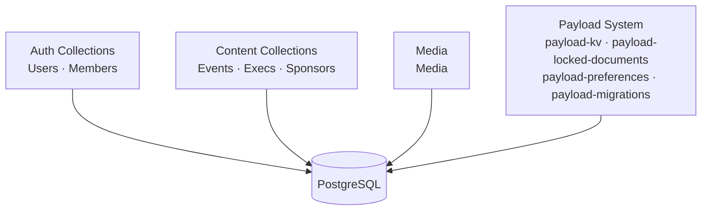
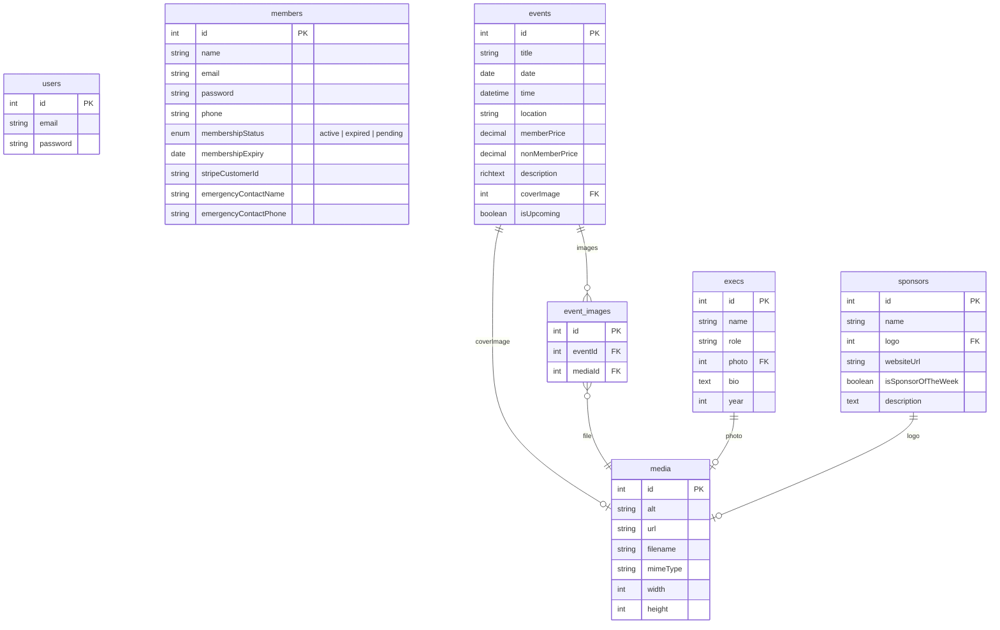

# Database

## Overview

The database is PostgreSQL, managed by [Payload CMS](https://payloadcms.com) using the `@payloadcms/db-postgres` adapter. The schema is defined through Payload collection configs in `cms/src/collections/` and registered in `cms/src/payload.config.ts`. Payload applies schema changes automatically in development; production changes must be applied with Payload migrations.

The generated TypeScript types live in `cms/src/payload-types.ts` — regenerate them after any schema change:

```bash
cd cms
pnpm generate:types
```

## Collections


```mermaid
graph TD
    A["Auth Collections<br/>Users · Members"] --> DB
    B["Content Collections<br/>Events · Execs · Sponsors"] --> DB
    C["Media<br/>Media"] --> DB
    D["Payload System<br/>payload-kv · payload-locked-documents<br/>payload-preferences · payload-migrations"] --> DB
    DB[("PostgreSQL")]
```

### Auth collections

**`users`** — Payload admin accounts. Email/password auth is built in. Anyone with a user account can access the `/admin` panel.

**`members`** — SSA member accounts. Email/password auth enabled. Separate from admin users — members do not have CMS admin access.

### Content collections

**`events`** — Events displayed on the public site. Read-only from the web app's perspective; managed by admins in the CMS.

**`event-registrations`** — Attendee details, event and optional member-account links, price, payment status, and unique Stripe session/payment IDs. Managed by admins and the trusted registration/payment endpoints.

**`execs`** — Executive committee members displayed on the About page.

**`sponsors`** — Sponsors displayed on the Sponsors page, with one optionally highlighted as sponsor of the week.

### Media

**`media`** — All uploaded files (images, etc.). Used by Events (cover image + gallery), Execs (photo), and Sponsors (logo). Every upload requires an `alt` text field.

## Schema


```mermaid
erDiagram
    users {
        int id PK
        string email
        string password
    }

    members {
        int id PK
        string name
        string email
        string password
        string phone
        enum membershipStatus "active | expired | pending"
        date membershipExpiry
        string stripeCustomerId
        string emergencyContactName
        string emergencyContactPhone
    }

    events {
        int id PK
        string title
        date date
        datetime time
        string location
        decimal memberPrice
        decimal nonMemberPrice
        richtext description
        int coverImage FK
        boolean isUpcoming
    }

    event_images {
        int id PK
        int eventId FK
        int mediaId FK
    }

    execs {
        int id PK
        string name
        string role
        int photo FK
        text bio
        int year
    }

    sponsors {
        int id PK
        string name
        int logo FK
        string websiteUrl
        boolean isSponsorOfTheWeek
        text description
    }

    media {
        int id PK
        string alt
        string url
        string filename
        string mimeType
        int width
        int height
    }

    events ||--o| media : "coverImage"
    events ||--o{ event_images : "images"
    event_images }o--|| media : "file"
    execs ||--o| media : "photo"
    sponsors ||--o| media : "logo"
```

## Environment variables

| Variable         | Required | Purpose                      |
| ---------------- | -------- | ---------------------------- |
| `DATABASE_URL`   | Yes      | PostgreSQL connection string |
| `PAYLOAD_SECRET` | Yes      | JWT signing secret for auth  |

## Adding a new collection

1. Create a new file in `cms/src/collections/` (e.g. `Events.ts`).
2. Define the collection config and export it.
3. Register it in `cms/src/payload.config.ts` under `collections: [...]`.
4. Run `pnpm dev` — Payload applies the schema change automatically in development.
5. Run `pnpm generate:types` to update `payload-types.ts`.
6. Run `pnpm migrate:create descriptive_name` to generate a migration from the previous committed schema snapshot. Review both `up` and `down`, including foreign-key ordering.
7. Test the migration against a disposable database or a restored copy of production, then commit the collection, types, and all generated files in `cms/src/migrations/` (including JSON snapshots and `index.ts`).

## Production migrations

Payload's [`prodMigrations`](https://payloadcms.com/docs/database/migrations) configuration imports the migration index into the standalone CMS server. Pending migrations run when Payload initializes its production database connection, before serving CMS requests. A migration failure prevents initialization; completed migrations are recorded in `payload_migrations` and skipped on later starts. This also works in the root Dockerfile without shipping the Payload CLI or TypeScript sources separately.

To apply migrations explicitly before starting the new server, run from `cms/` with the target database environment configured:

```bash
pnpm migrate
```

This command disables the automatic startup migration hook so the CLI owns the migration run. For other production migration CLI commands (for example `migrate:status`), use `PAYLOAD_MIGRATING=true NODE_ENV=production pnpm payload migrate:status` for the same reason. Do not run migrations concurrently from multiple deploying instances.

The initial migration history is:

- `20260906_223448_baseline`: the pre-RSVP schema from PR #157's base (`67e652a`), including Users, Members, Sponsors, Execs, Events, Media, and Payload's internal tables.
- `20260906_223523_event_rsvps`: adds event time/location/prices, the Event Registrations table and enums, payment uniqueness indexes, and Payload's document-lock relationship.

An empty database applies both migrations. Existing databases need the one-time baseline adoption below before deploying this version; replaying the initial `CREATE TABLE` statements against an existing schema will fail.

### Adopting an existing database

The repository previously contained no migrations or production migration runner. There is no checked-in evidence of how earlier schema changes were applied to production. Do not infer that an existing database matches the baseline just because it contains Members or Sponsors.

1. Back up the database and restore it into a disposable staging database. Compare its schema with `cms/src/migrations/20260906_223448_baseline.json` and the baseline SQL: tables, columns, enums, defaults, nullability, indexes, and foreign keys must match. Resolve any differences before recording the baseline. If the RSVP schema was already pushed manually, reconcile it separately; do not replay the RSVP migration over it.
2. Only after verifying that the pre-RSVP schema already exists, record the baseline as applied on the restored database:

   ```sql
   BEGIN;
   INSERT INTO payload_migrations (name, batch)
   SELECT '20260906_223448_baseline', 0
   WHERE NOT EXISTS (
     SELECT 1 FROM payload_migrations
     WHERE name = '20260906_223448_baseline'
   );
   DELETE FROM payload_migrations WHERE batch = -1;
   COMMIT;
   ```

   The deleted `batch = -1` row is Payload's development-push marker, not application data. Clearing it after schema verification avoids Payload's interactive development-schema warning during unattended startup.
3. Run `pnpm migrate` against the restored database. Verify existing data survives and event registrations can be created. Repeat baseline adoption on production only after this rehearsal, then deploy or run `pnpm migrate` before startup.

Keep development push and production migrations on separate databases. Rolling back the RSVP migration removes registrations and the new event fields; back up first. Never roll back the initial baseline on a database whose existing schema was adopted.

## Event date display

Payload stores both `date` and the optional `time` as ISO timestamps, even with `dayOnly` and `timeOnly` pickers. The web app uses `web/src/lib/eventDate.ts` to display the day from `date` and the clock time from `time` in `Pacific/Auckland`, regardless of the visitor or server timezone. The date attached to the time field is not used as the event day. Missing or invalid times display only the event date.
